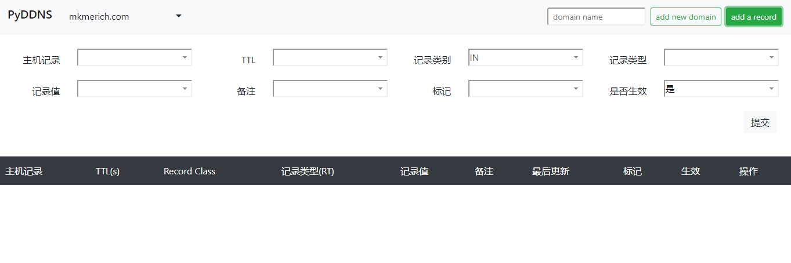
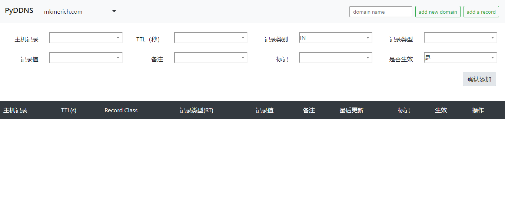

# pyddns

pyddns is a high performance dns server writen by python with asyncio library.
The server has a simple but enough UI, except that you can also invoke api to manage your dns records.

----

## features
1. add / delete / update record
2. simple ui
3. request ip based resolve rule
4. dynamic dns,  add dynamic record by api

## ref

- UDNS https://github.com/prologic/udns
- async_DNS https://github.com/drunkpig/async_dns
- dns knowledge https://www.zytrax.com/books/dns/ch8/
- dns zonefile  https://en.wikipedia.org/wiki/Zone_file
- bootstrap4 select box https://developer.snapappointments.com/bootstrap-select/examples/#live-search
- jquery select input http://indrimuska.github.io/jquery-editable-select/
- html转义与反转义 https://www.sojson.com/rehtml
- https://github.com/sudouser2010/flask_optional_routes
- https://flask-httpauth.readthedocs.io/en/latest/
